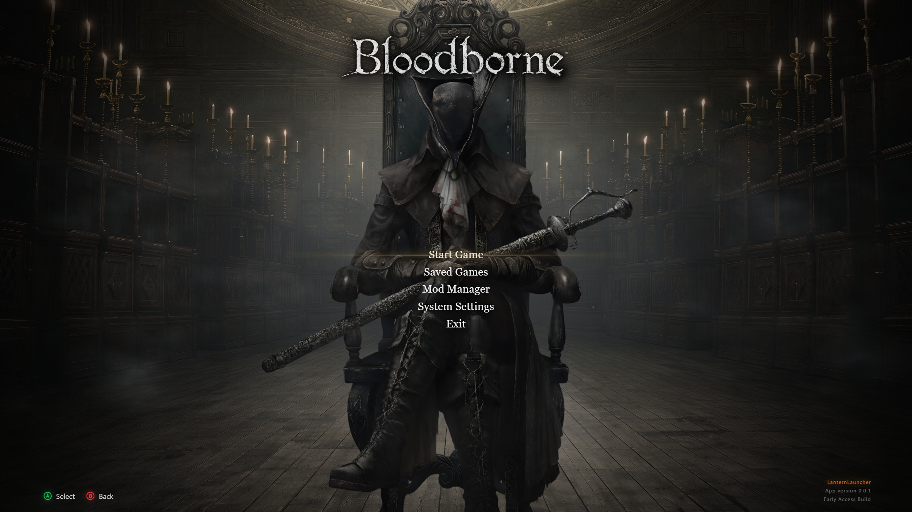
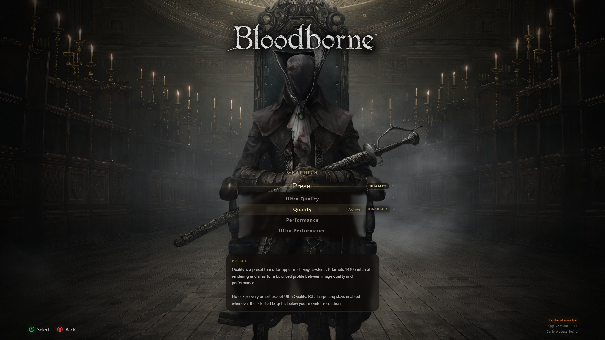
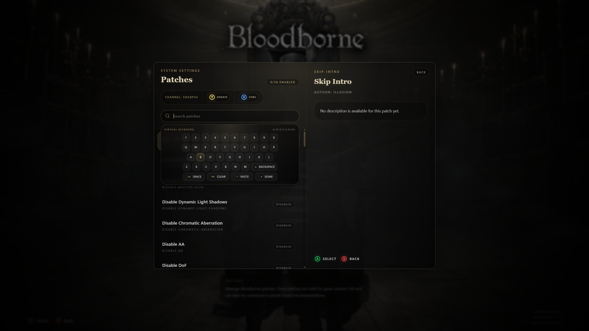
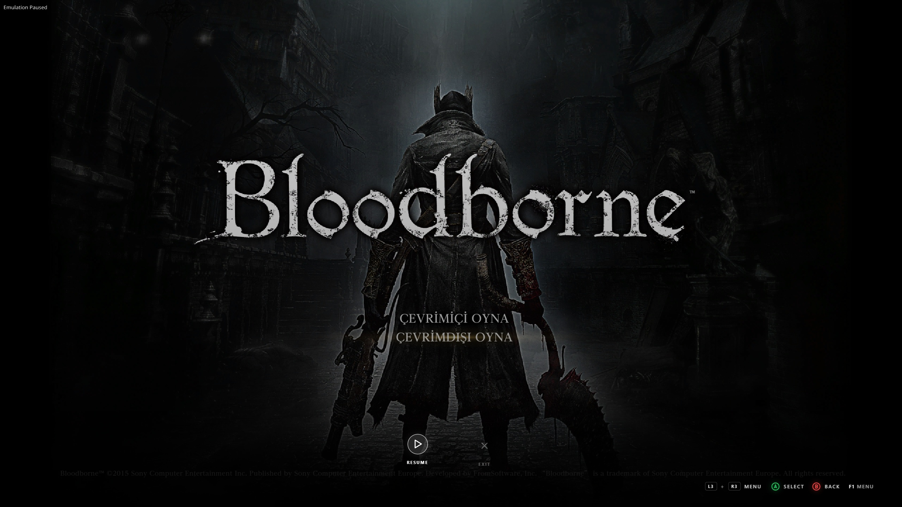

# An interactive launcher for Bloodborne shadPS4 emulator

An alternative to BB_Launcher that allows you to control Bloodborne fully interactively on an emulator and offers presets.

| Main Menu | Graphics | Patches | In-Game overlay |
|----------|----------|----------|-----------------|
|  |  |  | 

> [!WARNING]  
> This project is in a early stage. The launcher is available for use, but some of features are not yet fully developed.

## Features

* Borderless console-like GPU accelerated UI
* In-game overlay support (only on Windows)
* Fully designed for controllers (Xbox 360/One & DualSense) and keyboard & mouse
* Bundled graphics settings
* Auto ShadPS4 downloader, updater
* Mod & Patch Manager
* General ShadPS4 settings management
* And more..

## Usage

### Windows

* Download the Windows build from Releases.
* Extract the portable package and run `app.exe`.
* On first launch, choose your Bloodborne game folder. It must be a supported `CUSA` folder and contain `eboot.bin`.
* LanternLauncher will prepare shadPS4, patch files, and user data automatically before opening the main menu.

### Linux / macOS

* Download the build for your platform from Releases.
* Extract the package and run `./app`.
* On first launch, choose your Bloodborne game folder. Lantern handles the initial shadPS4 setup for you.

### Headless

* Use `./app -n` after the first setup if you want to skip the launcher UI and start Bloodborne directly.

## Compatible

* This launcher compatible all Bloodborne variants but we recommended GOTY (CUSA03173) version.
* Your dumped game should have a updated of version 1.09.
* ShadPS4 15.01+
* Xbox Controller 360/S/X, DualSense (not backend for DualShock 4)

## Supported languages

Now only support languages are English and Turkish.

## Build

* Requirements: Node.js 20+, npm, .NET SDK 10.
* Install dependencies with `npm install`.
* Run the app in dev mode with `npm run dev`.
* Build renderer and Electron output with `npm run build`.
* Create CI-style zip packages with `npm run dist:ci`.

### In VSCode Tasks

* Open project in VSCode.
* Select `Terminal > Run Task` and run any command.

## Disclaimer

LanternLauncher is simply a launcher; it allows you to easily configure emulator settings.

This project does not contain any copyrighted system firmware, game data, or proprietary PlayStation or FromSoftware assets. The entire design and backend were written from scratch and are original.

## Used technologies

This project uses a shared application framework that supports Electron, Web, and Mobile. Only the Electron target is used here; other platform-specific code is not relevant for this project.

* Electron
* Svelte
* TypeScript
* Tailwind
* Tabler Icons

## License

This project is open source and always welcome contributors.

* [**GPL-2.0 license**](./LICENSE.txt)
